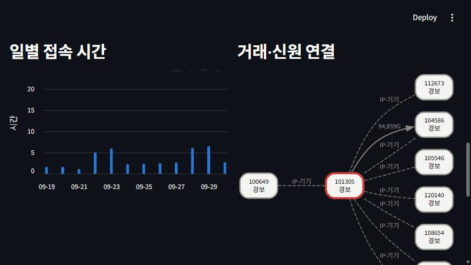

# GameGuard — MMORPG 경제 로그 이상탐지 + LLM 조사 에이전트

> 작업 중 (2026-10). 설계: `JobApplication2026/design/P1_GameGuard_이상탐지.md`

정답 라벨이 있는 **합성 MMORPG 로그**에서 작업장 봇·RMT 거래망·매크로·다계정·시세조작·차지백을 탐지한다.
탐지는 **SQL 룰 → 계정 피처 ML → 거래 그래프** 3단으로 쌓고, 걸린 계정은 **로컬 LLM 조사 에이전트**가 증거를 모아 판정·근거를 쓴다(제재는 사람 승인).

## 현재 결과 (평가 월드 seed 2026 — 룰·모델·임계값은 개발 월드 seed 42에서만 정함)

| 단계 (누적) | 경보 | 정밀도 | 재현율 | F1 | 오탐 |
|---|---:|---:|---:|---:|---:|
| 1단 SQL 룰 9개 | 793 | **0.997** | 0.682 | 0.810 | 2 |
| + 2단 LightGBM-sanctioned (룰 밖 검토 예산 300) | 1,110 | 0.895 | 0.857 | 0.875 | 117 |
| + 3단 신원 그룹 송금 집중 | 1,208 | 0.903 | 0.941 | 0.922 | 117 |
| **+ 3단 경보 전파 (최종)** | 1,245 | 0.896 | **0.962** | **0.928** | 130 |

| 은닉형 재현율 | 1단 룰 | +2단 ML | +3단 그래프 |
|---|---:|---:|---:|
| 다계정 | 0.000 | 0.299 | **0.824** |
| RMT 링 | 0.113 | 0.849 | **0.962** |
| 차지백 | 0.333 | 0.690 | **0.976** |
| 매크로 | 0.323 | **0.984** | 0.984 |
| 시세조작 | 0.875 | 1.000 | 1.000 |
| 작업장 봇 | 1.000 | 1.000 | 1.000 |

- **2단 LightGBM-sanctioned** 는 실서비스 조건: 개발 월드에서 *룰에 걸려 확정된 계정만* 양성으로 학습한다. 은닉형을 한 번도 보지 않았지만 RMT·매크로 은닉형을 찾아낸다. 룰 밖 상위 300명 검토 큐의 **63.3%** 가 실제 어뷰저 (IsolationForest 48.0%). 전체 정답으로 학습한 모델(oracle)은 F1 0.995 — 합성 데이터라 지나치게 쉬워 상한선으로만 본다.
- **3단 신원 그룹 송금 집중** 은 라벨 없이 구조만 본다: 주 IP·기기를 공유하는 4~30명 중 3명 이상이 한 계정에 송금의 70%+ 를 몰아줌. 기기를 바꾸는 은닉형 다계정을 **오탐 추가 0건**으로 잡는다.
- **3단 경보 전파** 는 룰 히트를 씨앗으로, 거래·신원 연결의 70%+ 가 씨앗 쪽인 계정을 올린다 (은닉형 RMT 구매자·차지백 수령 경로).

### 결과를 의심한 기록
- 룰 첫 평가 F1 0.99 → 데이터가 룰에 맞춰져 있다고 보고 **은닉형 40%** 를 추가, 개발/평가 월드를 분리했다.
- 첫 ML 개발 OOF F1 0.997, 중요도 상위가 *신규 계정 여부·좌표 퍼짐* → 시뮬레이터 지름길(정상 신규 유저 없음, 정상 좌표 균등 분포)을 고쳤다.
- 경보 전파를 개발 월드에서는 룰 히트를 씨앗으로 조정했는데, 평가 월드에서 실수로 ML 경보까지 씨앗에 넣어 실행했다(최종 F1 0.897, 오탐 213). 검토 전 ML 경보의 오탐에서 전파가 번진 것으로, 개발 조건과 같게 **룰 히트만 씨앗**으로 고정했다. 두 결과를 모두 남긴다.

상세: [룰](reports/eval_rules_test.md) · [2단](reports/eval_stage2_test.md) · [3단](reports/eval_stage3_test.md)

## 4단 — LLM 조사 에이전트 (로컬 LLM, API 비용 0원)

경보가 뜬 계정을 LLM이 읽기 전용 도구 6개(계정 요약·접속 패턴·골드 흐름·거래 상대·신원 공유·SELECT 조회)로 조사하고, **조사 매뉴얼**(유형별 수치 확인 항목, 2개 이상 충족해야 abuse)에 따라 판정·근거·권고를 JSON으로 낸다. 제재는 항상 사람이 승인한다.

- 모델: `qwen3-vl:8b-instruct` — **로컬 Ollama (RTX 4070 SUPER)**, 유료 API 없이 동작하고 데이터가 PC 밖으로 나가지 않는다. 백엔드는 `chat()` 인터페이스 하나라 Claude·OpenAI API 로 바꿔 끼울 수 있다
- 안전장치: 정답은 별도 DB 파일, 에이전트 연결은 읽기 전용 + 외부 파일 접근 차단, 우회 쿼리 6종 테스트
- 프롬프트는 개발 월드에서만 v1→v3 로 개선하고 고정 ([개발 기록](reports/agent_prompt_dev.md))

**평가 월드 경보 150건** (경보 출처로만 층화 추출: 룰 포함 50 + 룰 밖 100, 실제 어뷰저 117 / 1~3단 오탐 33)

| 지표 | 값 |
|---|---:|
| 1~3단 오탐 중 에이전트가 정상으로 걸러냄 | **63.6%** (21/33) |
| 실제 어뷰저를 어뷰징/불확실로 유지 | **93.2%** (109/117) |
| 어뷰징 판정의 유형 정확도 | **84.9%** (LLM 없는 기준선 72.6%) |
| 근거 수치가 도구 결과와 일치 | **96.6%** (496개) |
| 건당 시간 (중앙값) | 21.1초 · 도구 5회 · 입력 1만 / 출력 1.5천 토큰 |

- 에이전트가 normal 로 넘긴 경보 29건(19.3%)은 검토자가 보지 않아도 되지만, 그중 8건은 실제 어뷰저(놓침)다 — 자동 종결이 아니라 "검토 우선순위 낮춤"으로 쓰는 것이 맞다
- 약점: 차지백(유지 52.9%)과 매크로 유형 분류. 8B 모델이 "2배 이상" 같은 수치 비교를 가끔 틀린다
- 첫 평가 실행은 일부 응답이 1만 토큰 넘게 반복 생성되는 문제로 중단하고(6건에서 중단, 기록 보존), 응답 길이 상한(2,048)을 넣은 뒤 처음부터 다시 실행했다. 상한에 걸린 4건은 uncertain 처리

상세: [reports/eval_agent_test_v3.md](reports/eval_agent_test_v3.md)

## 운영 — 일일 배치와 검토 대시보드

**일일 배치** (`python -m gameguard.run`): 품질 체크 → 룰 → ML → 그래프 → 경보 → 조사 에이전트 → 실행 기록.
- 단계마다 로그·JSON 기록(`data/out_*/runs/`), 실패해도 멈추지 않고 그 결과에 기대는 뒤 단계만 건너뛴다
- 에이전트는 **아직 조사하지 않은 경보만** 우선순위(걸린 단계 수 → 룰 밖 경보 → ML 점수) 순으로 예산만큼 조사 → 매일 돌려도 중복 없음
- 탐지 1~3단은 평가 월드 2,347만 행 기준 약 4초, 에이전트는 건당 약 20초
- Windows 작업 스케줄러 등록: `scripts/register_task.ps1` (직접 실행할 때만 등록)

**검토 대시보드** (`streamlit run app/streamlit_app.py`): 정답을 읽지 않는 운영 화면.
- 경보 큐: 에이전트 판정(어뷰징 → 불확실 → 미조사 → 정상)·걸린 단계·ML 백분위 순 정렬, 필터
- 계정 조사: 에이전트 보고서(근거 표·도구 호출 기록), 일별 접속 시간, 거래·신원 연결 그래프, 거래 상대
- 사람 검토 기록: 제재 확정 / 모니터링 / 오탐 → `reviews.jsonl` (확정 제재는 다음 ML 재학습의 양성 라벨)
- 배치 실행 기록, 평가 보고서



## 데이터

`sim/` 이 30일치 월드를 만든다 (기본 설정 기준).

| 테이블 | 행 수 | 내용 |
|---|---:|---|
| accounts | 2.1만 | 생성일, 기기, IP, 길드, 레벨 |
| sessions | 39만 | 접속·종료, 기기·IP (PC방 접속 포함) |
| actions | 2,300만+ | 사냥·루팅·스킬·이동·채팅·제작, 사냥터, 좌표 |
| currency_log | 106만 | 골드 증감과 잔액 (드랍·퀘스트·상점·거래·결제·환불) |
| trades / market_listings | 6.7만 / 5.5만 | 1:1 거래, 거래소 |
| payments | 6.6천 | 결제·환불 |

**행위자:** 정상 2만 명 (헷갈리는 정상: 하루 8~14시간 하드코어, 기기를 공유하는 가족, 선물을 받는 길드장, 정상 환불, 기간 중 가입한 신규 유저 10%)
\+ 어뷰저 6유형. 각 유형의 40%는 **은닉형**이다: 사람 같은 리듬의 봇, 지터를 넣은 매크로, 기기를 바꾸는 다계정, 골드를 쪼개 넘기는 RMT, 천천히 매집하는 시세조작, 거래소를 거치는 차지백.

정답 라벨은 `labels` 스키마에 따로 두고, 탐지 코드가 라벨을 참조하면 테스트가 실패한다.

## 탐지 1단 — SQL 룰 (`sql/rules/`, 임계값 `config/rules.yaml`)

| 룰 | 잡는 것 |
|---|---|
| R01 장시간 접속 | 하루 18시간+ 접속일 5일 이상 |
| R02 기계적 리듬 | 행동 간격 변동계수 < 0.3 세션 3개 이상 |
| R03 골드 유출 | 번 골드의 70% 이상을 대가 없이 3명 이하에게 송금 |
| R04 주 기기 공유 | 같은 기기를 주 기기로 쓰는 계정 4~30개 (PC방 제외) |
| R05 비정상 단가 | 아이템별 robust z ≥ 6 (거래소는 판매자만) |
| R06 자전거래 | 같은 쌍·같은 아이템 7일 내 양방향 3회+ |
| R07 차지백 순서 | 결제 → 24시간 내 송금 → 환불 |
| R08 골드 수거 | 5명+에게서 100만+ 골드, 자기 수입의 3배+ |
| R09 매집 | 같은 아이템 48시간 내 거래소 15개+ 구매 |

## 실행

```bash
python -m venv .venv && .venv\Scripts\pip install -r requirements.txt
python -m sim.generate                                   # 개발 월드 → data/raw
python -m sim.generate --seed 2026 --out data/raw_test   # 평가 월드
python -m gameguard.db load --raw data/raw_test --db data/test.duckdb
python -m gameguard.quality --db data/test.duckdb        # 품질 체크 6종
python -m gameguard.rules --db data/test.duckdb --out data/out_test
python -m gameguard.rules --db data/gameguard.duckdb --out data/out_gameguard   # 개발 월드 룰 (학습용)
python -m gameguard.evaluate rules                       # 평가 월드 룰 평가
python -m gameguard.models train --mode sanctioned       # 개발 월드에서 학습 (oracle 도 같은 방식)
python -m gameguard.models score --mode sanctioned --db data/test.duckdb --out data/out_test
python -m gameguard.evaluate stage2
python -m gameguard.graph --db data/test.duckdb --out data/out_test   # 씨앗 = 룰 히트
python -m gameguard.evaluate stage3
python -m gameguard.alerts --out data/out_test                       # 최종 경보 + 단계별 근거
ollama pull qwen3-vl:8b-instruct                                     # 로컬 LLM (최초 1회)
python -m gameguard.agent.agent --db data/test.duckdb --out data/out_test --n-rule 50 --n-other 100 --prompt v3 --tag test_v3
python -m gameguard.evaluate agent --tag test_v3
python -m gameguard.run --db data/test.duckdb --out data/out_test --agent-budget 20   # 일일 배치 (위 단계를 한 번에)
streamlit run app/streamlit_app.py -- --db data/test.duckdb --out data/out_test    # 검토 대시보드
python -m pytest
```

## 로드맵
- [x] 합성 로그 생성기 (어뷰징 6유형 + 은닉형 + 헷갈리는 정상)
- [x] DuckDB 적재, 품질 체크, 라벨 누수 테스트
- [x] SQL 룰 9개 + 개발/평가 월드 분리 평가
- [x] 계정 피처 SQL(52개) + IsolationForest / LightGBM (oracle·sanctioned 라벨 비교)
- [x] 거래·신원 그래프 (신원 그룹 송금 집중 + 룰 히트 기반 경보 전파)
- [x] LLM 조사 에이전트 (로컬 Ollama) + 평가
- [x] Streamlit 검토 대시보드, 일일 배치 (실패 격리·중복 없는 에이전트 조사)
- [ ] 방법론 문서
