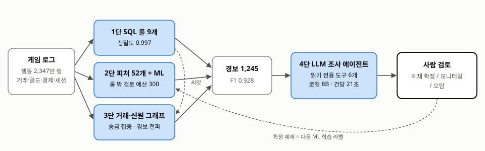

# GameGuard 이상탐지 방법론

**MMORPG 경제 로그에서 어뷰징을 찾는 SQL 룰 · ML · 그래프 · LLM 조사 에이전트**

이희원 · 2026-10 · 코드 `github.com/heewonle/gameguard`

---

## 요약

정답 라벨이 있는 합성 MMORPG 로그(계정 2.1만, 행동 2,347만 행, 30일)에서 어뷰징 6유형 — 작업장 봇, RMT 링, 매크로, 다계정, 시세조작, 차지백 — 을 탐지했다. 어뷰저의 40%는 룰을 피하도록 사람처럼 행동하는 **은닉형**이다.

탐지는 세 단을 쌓는다. **1단 SQL 룰**이 확실한 것을 높은 정밀도로 잡고, **2단 ML**이 룰로 확정된 계정만으로 학습해 룰 밖의 의심 계정을 검토 큐로 올리고, **3단 거래·신원 그래프**가 계정 하나만 봐서는 보이지 않는 조직 구조를 찾는다. 걸린 계정은 **4단 LLM 조사 에이전트**가 읽기 전용 도구로 증거를 모아 판정 초안을 쓰고, 제재는 사람이 결정한다.

모든 임계값·모델·프롬프트는 **개발 월드(seed 42)**에서만 정했고, 아래 숫자는 한 번도 보지 않은 **평가 월드(seed 2026)** 결과다.

| 단계 (누적) | 경보 | 정밀도 | 재현율 | F1 |
|---|---:|---:|---:|---:|
| 1단 SQL 룰 9개 | 793 | 0.997 | 0.682 | 0.810 |
| + 2단 ML (룰 밖 검토 예산 300) | 1,110 | 0.895 | 0.857 | 0.875 |
| + 3단 신원 그룹 송금 집중 | 1,208 | 0.903 | 0.941 | 0.922 |
| + 3단 경보 전파 | **1,245** | **0.896** | **0.962** | **0.928** |

은닉형 재현율은 다계정 0 → 0.824, RMT 0.113 → 0.962, 차지백 0.333 → 0.976, 매크로 0.323 → 0.984로 올랐다. 조사 에이전트는 1~3단 오탐의 63.6%를 정상으로 걸러내면서 실제 어뷰저의 93.2%를 유지했다.



---

## 1. 문제와 위협 모델

게임 경제에서 어뷰징의 피해는 세 갈래다.

- **재화 인플레이션** — 작업장 봇·매크로가 골드를 대량으로 만들어 시세를 무너뜨린다
- **현금 유출** — RMT 조직이 게임 밖에서 골드를 팔아 매출을 가져가고, 차지백은 결제를 취소해 직접 손실을 낸다
- **공정성** — 다계정·시세조작이 정상 유저의 경쟁 조건을 망가뜨린다

탐지 목표는 이 피해에 맞춰 정했다.

1. **정밀도를 먼저 지킨다.** 정상 유저를 제재하는 비용(이탈·민원·신뢰)이 어뷰저 하나를 놓치는 비용보다 크다. 그래서 1단 룰은 정밀도 0.99 이상을 기준으로 임계값을 잡았다.
2. **사람이 볼 수 있는 양만 올린다.** 룰 밖 의심 계정은 검토 인력 예산(30일 데이터당 300명) 안에서 순위대로 올린다.
3. **자동 제재는 하지 않는다.** 모든 단계는 경보와 근거까지만 만들고, 제재는 사람이 확정한다. 확정 결과는 다음 학습의 라벨이 된다.

## 2. 데이터와 재화 흐름 모델

### 2.1 왜 합성 데이터인가
실제 게임 로그는 접근할 수 없고, 접근하더라도 **무엇이 어뷰징인지에 대한 정답**이 없다. 탐지 방법을 비교하려면 정답이 있어야 하므로, 재화 흐름과 행위자를 모델링한 시뮬레이터를 직접 만들었다. 대신 시뮬레이터를 만든 사람이 탐지기도 만들면 **데이터가 탐지기에 맞춰지는** 위험이 있다. 이 위험을 다루는 방법은 3장에 적었다.

### 2.2 테이블

| 테이블 | 평가 월드 행 수 | 내용 |
|---|---:|---|
| accounts | 21,159 | 생성일, 기기, IP, 길드, 레벨 |
| sessions | 약 39만 | 접속·종료 시각, 기기, IP (PC방 접속 포함) |
| actions | 약 2,300만 | 사냥·루팅·스킬·이동·채팅·제작, 사냥터, 좌표 |
| currency_log | 약 106만 | 골드 증감, 잔액, 사유 |
| trades / market_listings | 약 6.5만 / 5.5만 | 1:1 거래, 거래소 매물 |
| payments | 약 6.6천 | 결제·환불 |

정답 라벨은 **별도 DB 파일**에 두었다. 탐지 DB에는 정답이 물리적으로 없어서, 탐지 SQL이나 LLM 에이전트가 어떤 쿼리를 써도 정답에 닿지 않는다. 채점 모듈만 정답 파일을 붙인다(테스트로 검사).

### 2.3 재화 흐름
- **생성**: 사냥 드랍(사냥터별 킬당 골드), 퀘스트 보상, 결제(원 → 골드)
- **이동**: 1:1 거래(구매자 → 판매자 골드, 아이템 없이 골드만 보내기 가능), 거래소(수수료 5%)
- **소멸**: 상점 소비, 거래소 수수료, 환불 회수

잔액 연속성(직전 잔액 + 증감 = 현재 잔액), 거래 1건 = 골드 기록 2행, 세션 겹침 없음 등 품질 체크 6종을 매 실행마다 통과시킨다.

### 2.4 행위자
- **정상 2만 명** — 탐지기를 헷갈리게 하는 정상을 일부러 넣었다: 하루 8~14시간 접속하는 하드코어(3%), 기기를 공유하는 가족(5%), 길드원에게 선물을 받는 길드장, 정상 환불(1%), 기간 중 가입한 신규 유저(10%), PC방 접속
- **어뷰저 6유형, 약 1,160명** — 각 유형의 40%는 은닉형이다

| 유형 | 일반형 | 은닉형이 피하는 방법 |
|---|---|---|
| 작업장 봇 | 하루 20시간, 일정한 행동 간격, 번 골드 90%를 수거 계정에 송금 | 사람 같은 행동 간격(CV 0.5~0.9), 송금 50~68%로 줄임 |
| RMT 링 | 수거 → 판매 → 구매자에게 잡템 1개 값으로 수백만 골드 | 구매자 지급을 아이템 없이 3~8회로 쪼갬 |
| 매크로 | 새벽 고정 시각에 기계적 반복 | 행동 간격에 지터(CV 0.25~0.45) |
| 다계정 | 부계정 4~8개가 한 기기에서 본계정으로 송금 | 기기 정보를 계정마다 바꿈(IP는 같음) |
| 시세조작 | 48시간 매집 → 3배 재등록 → 자전거래 | 6일에 걸쳐 천천히 매집, 자전거래 안 함 |
| 차지백 | 결제 → 수령자에게 1:1 송금 → 환불 | 수령자의 거래소 잡템을 비싸게 사는 방식으로 이전 |

## 3. 평가 설계 — 결과를 믿을 수 있게

**개발 월드와 평가 월드.** 같은 설정, 다른 시드로 두 월드를 만들었다. 룰 임계값, ML 모델·임계값, 그래프 파라미터, 에이전트 프롬프트는 모두 개발 월드에서만 정하고, 평가 월드는 점수를 매길 때만 쓴다.

**실서비스와 같은 라벨 조건.** 실제 운영에서는 "과거에 제재가 확정된 계정"만 정답으로 안다. 그래서 2단 ML은 개발 월드에서 **룰에 걸려 확정된 계정만** 양성으로 학습했다(sanctioned). 룰이 놓친 어뷰저는 정상으로 섞인 채 학습한다. 전체 정답으로 학습한 모델(oracle)은 F1 0.995가 나왔지만, 합성 데이터라 지나치게 쉬운 상한선으로만 기록했다.

**결과를 의심한 기록.** 결과가 너무 좋게 나올 때마다 데이터를 먼저 의심했다.

| 무엇이 나왔나 | 원인 | 조치 |
|---|---|---|
| 룰 첫 평가 F1 0.99 | 어뷰저가 룰에 딱 맞게 행동하도록 생성됨 | 은닉형 40% 추가, 개발/평가 월드 분리 |
| 첫 ML 개발 OOF F1 0.997, 중요도 1위 *신규 계정 여부* | 정상 유저는 모두 기간 전에 가입, 정상 좌표는 균등 분포 — 시뮬레이터 지름길 | 정상 신규 유저 10%, 세션별 사냥 거점 좌표, 계정별 행동 비율 개인차 |
| 경보 전파 오탐 213건 (평가 월드) | 평가 실행에서 실수로 검토 전 ML 경보까지 씨앗으로 사용 (개발 조정은 룰 히트 씨앗) | 개발 조건과 같게 룰 히트만 씨앗으로 고정, 두 결과 모두 공개 |

## 4. 탐지 구조

### 1단 — SQL 룰 9개
확실한 패턴을 설명 가능한 쿼리로 잡는다. 룰마다 계정·점수·근거(JSON)를 반환한다.

| 룰 | 조건 | 평가 월드 경보 | 정밀도 |
|---|---|---:|---:|
| R01 장시간 접속 | 하루 18시간+ 접속일 5일+ | 167 | 1.000 |
| R02 기계적 리듬 | 행동 간격 CV < 0.3 세션 3개+ | 216 | 1.000 |
| R03 골드 유출 | 번 골드 70%+ 를 대가 없이 3명 이하에게 | 155 | 1.000 |
| R04 주 기기 공유 | 같은 기기를 주 기기로 쓰는 계정 4~30개 | 383 | 1.000 |
| R05 비정상 단가 | 아이템별 로그 단가 robust z ≥ 6 | 299 | 1.000 |
| R06 자전거래 | 같은 쌍·아이템 7일 내 양방향 3회+ | 12 | 1.000 |
| R07 차지백 순서 | 결제 → 24시간 내 송금 → 그 결제 환불 | 63 | 0.968 |
| R08 골드 수거 | 5명+ 에게서 100만+, 자기 수입 3배+ | 17 | 1.000 |
| R09 매집 | 같은 아이템 48시간 내 거래소 15개+ | 3 | 1.000 |

"대가 없는 송금"은 지불 골드에서 받은 아이템의 거래소 중앙가를 뺀 값이다. 정상가로 아이템을 산 거래를 송금으로 세지 않기 위해서다(개발 월드에서 이 정의와 최소 수입 기준 30만 골드로 R03 오탐 645건 → 1건).

### 2단 — 계정 피처 52개 + LightGBM
피처도 SQL 한 파일로 만든다(평가 월드 3.4초). 접속 시간 분포, 행동 간격 규칙성(세션별 CV의 중앙값·최솟값), 행동 종류 비율, 좌표 퍼짐, 대가 없는 송금·수령과 그 비율, 거래 상대 집중도, 거래소 고가 매매, 매집, 결제·환불, 주 IP·기기 공유 계정 수, 계정 나이 등.

- 학습: 개발 월드, 룰로 확정된 824명만 양성 (sanctioned)
- 임계값: 학습 라벨이 룰 히트뿐이라 F1로 고르면 "룰 밖은 모두 정상"이 최적이 된다. 대신 **룰 밖 상위 300명**을 검토 큐로 보내는 점수를 임계값으로 쓴다
- 결과: 검토 큐 300명 중 **63.3%가 실제 어뷰저** (IsolationForest 비지도 48.0%). 은닉형을 학습한 적이 없는데도 RMT 구매자(받은 골드 비율), 매크로(세션 리듬 최솟값)를 일반형에서 일반화해 찾는다

### 3단 — 거래·신원 그래프
계정 하나만 봐서는 정상과 구분되지 않는 조직을 연결 구조로 찾는다. 간선은 대가 없는 골드 이동(3만 골드 이상)과 주 IP·주 기기 공유다.

- **신원 그룹 송금 집중** (라벨·씨앗 불필요): 주 IP·기기를 공유하는 4~30명 그룹에서 3명 이상이 송금의 70% 이상을 한 계정에 몰아주면 그 계정(hub)과 보낸 계정을 표시한다. 기기를 바꾸는 은닉형 다계정도 IP와 송금 구조는 남는다. **추가 오탐 0건**으로 은닉형 다계정 재현율을 0.299 → 0.824로 올렸다
- **경보 전파**: 룰 히트를 씨앗으로, 거래·신원 연결 가중치의 70% 이상이 씨앗 쪽인 계정을 올린다. RMT 판매 계정에게서 쪼개 받은 은닉형 구매자, 차지백 수령 경로를 잡는다. 검토 전인 ML 경보는 씨앗에서 뺀다 — 오탐에서 전파가 번진다(3장)

## 5. 유형별 방법론

아래 지표는 개발 월드의 유형별 중앙값이다(정상 / 일반형 / 은닉형).

### 5.1 작업장 봇
- **단서**: 하루 접속 1.3 / 20.0 / 20.1시간, 행동 간격 CV 1.19 / 0.10 / 0.68, 좌표 퍼짐 123 / 15 / 87, 채팅 비율 0.04 / 0 / 0.01
- **탐지**: 일반형은 R01·R02, 은닉형도 장시간 가동(R01)과 봇끼리의 기기 공유(R04)는 피하지 못한다
- **오탐 위험**: 하드코어 유저. 접속은 길지만 CV가 사람 수준이고 채팅·이동이 있다. 시뮬레이터의 하드코어 접속 시간을 설정(8~14시간)대로 고친 뒤 평가 월드 R01 오탐 0
- **결과**: 재현율 1.000 (일반·은닉 모두)

### 5.2 RMT 링
- **단서**: 구매자는 대가 없이 받은 골드가 자기 수입의 67배(중앙값). 수거·판매 계정은 여러 계정에게서 수백만 골드
- **탐지**: 일반형 구매자는 잡템 단가 이상치(R05), 수거·판매는 R08. 은닉형 구매자는 2단 ML(수령 비율 피처)과 3단 경보 전파(판매 계정과의 연결)
- **오탐 위험**: 길드장 선물(건당 1~10만 골드), 시세조작 피해자(시세 2~4배 매물 구매). 거래소 구매는 판매자만 표시하고, 그래프에서는 시세 10배 이상 구매만 이전으로 본다. 개발 월드 전파 오탐 89건 중 86건이 시세조작 피해자였고, 이 규칙을 넣은 뒤 20건으로 줄었다
- **결과**: 은닉형 재현율 0.113 → 0.962, 유형 전체 0.976

### 5.3 매크로
- **단서**: 평소 세션은 사람 같지만(하루 3.2시간) 새벽 고정 시각 세션의 CV 최솟값이 0.02(일반) / 0.34(은닉), 채팅 0
- **탐지**: 일반형 R02. 은닉형은 지터 때문에 CV 0.3 기준을 넘지만, 2단 ML이 *세션 리듬 최솟값*과 *새벽 접속 비율*로 잡는다
- **결과**: 은닉형 재현율 0.323 → 0.984

### 5.4 다계정
- **단서**: 주 IP 공유 계정 수 7~8(정상 1), 부계정 송금 비율 0.94, 한 사냥터 반복
- **탐지**: 일반형 R04(주 기기 공유). 은닉형은 기기를 바꿔 R04를 피하므로 3단 신원 그룹 송금 집중
- **오탐 위험**: PC방(공용 기기)과 가족(2~3명). "주 기기"(세션 과반)만 세서 PC방을 빼고, 그룹 최소 크기 4로 가족을 뺀다. 첫 R04는 PC방 때문에 정상 8,751명을 잡았다
- **결과**: 은닉형 재현율 0 → 0.824, 유형 전체 0.924. 놓친 은닉형 부계정 33명은 본계정으로 보낸 골드 합의 중앙값이 2.4만으로, 대부분 그래프 간선 기준(3만)에 못 미친다

### 5.5 시세조작
- **단서**: 같은 아이템 매집 8~10개(정상 1), 거래소 판매가 시세의 3.2배
- **탐지**: R05(판매 단가), R06(자전거래), R09(매집). 은닉형은 매집 속도를 늦추고 자전거래를 안 하지만 고가 판매(R05)는 피할 수 없다
- **결과**: 재현율 1.000

### 5.6 차지백
- **단서**: 결제 후 송금 비율 0.85, 환불 후 잔액 음수
- **탐지**: R07(결제 → 송금 → 환불 순서), R03. 은닉형은 거래소를 거쳐 R07을 피하지만, 수령자의 잡템 고가 판매가 R05에 걸리고, 결제자는 그 수령자와의 연결로 전파된다
- **결과**: 은닉형 재현율 0.333 → 0.976, 유형 전체 0.967. 놓친 결제자 4명은 데이터 기간 안에 결제 기록이 없다 — 이 30일만 보면 탐지할 행위가 없다

## 6. 오탐 분석

최종 경보 1,245건 중 오탐 130건의 출처 (평가 월드):

| 출처 | 일반 유저 | 길드장 | 하드코어 | 합계 |
|---|---:|---:|---:|---:|
| ML 검토 큐 | 95 | 18 | 2 | 115 |
| 경보 전파 | 10 | 2 | 1 | 13 |
| 룰 | 1 | 1 | 0 | 2 |
| 신원 그룹 송금 집중 | 0 | 0 | 0 | 0 |

오탐의 88%는 **검토 큐**에서 나온다. 이는 설계 의도다 — 룰 밖은 검토 예산만큼 순위로 올리고, 사람이(그리고 4단 에이전트가) 거른다. 룰과 그래프 구조 신호는 거의 오탐을 내지 않는다.

## 7. 4단 — LLM 조사 에이전트

### 7.1 구조
- **입력**: 경보 1건(걸린 단계·룰 근거·ML 백분위·그래프 신호)
- **도구 6개, 전부 읽기 전용**: 계정 요약(모집단 백분위 포함), 접속 패턴, 골드 흐름, 거래 상대(상대의 경보 여부), 신원 공유, SELECT 조회
- **안전장치**: 정답은 별도 파일, 에이전트 연결은 read-only + 외부 파일 접근 차단 + 쓰기·ATTACH·파일 읽기 함수 거부. 우회 쿼리 6종을 테스트로 막는다
- **출력**: JSON 스키마 강제 — 설명·근거를 먼저, 그다음 유형·판정·확신도·권고. 어뷰징 판정은 항상 사람 검토
- **모델**: `qwen3-vl:8b-instruct`, 로컬 Ollama (RTX 4070 SUPER). 유료 API 없이 동작하고 로그가 외부로 나가지 않는다. 백엔드는 `chat()` 인터페이스 하나라 Claude·OpenAI API로 바꿀 수 있다

### 7.2 조사 매뉴얼로서의 프롬프트
프롬프트는 개발 월드 경보로만 세 번 고쳤다.

| 버전 | 문제 | 고친 것 |
|---|---|---|
| v1 | 실제 어뷰저 24명 중 13명을 정상으로 판정. "다계정으로 보인다… 따라서 정상"처럼 설명과 판정이 어긋남. ML 확률이 0.0으로 반올림돼 "정상"으로 읽힘 | ML은 백분위로 전달, 최소 도구 호출 3회, 출력 순서를 설명 → 판정으로 |
| v2 | 반대로 정상 6건 모두 어뷰징. "ML 점수가 높아 의심"처럼 **경보 자체를 증거로** 씀 | 유형별 **수치 확인 항목 표**, "2개 이상 충족해야 abuse, 1개면 uncertain, 없으면 normal", "경보는 볼 이유이지 증거가 아니다" |
| v3 | 새 개발 표본 28건: 오탐 3/4 걸러냄, 어뷰저 23/24 유지 | 고정 → 평가 월드 실행 |

### 7.3 평가 월드 결과 (경보 150건, 경보 출처로만 층화 추출)

| 지표 | 값 |
|---|---:|
| 1~3단 오탐 중 정상으로 걸러냄 | 63.6% (21/33) |
| 실제 어뷰저를 어뷰징/불확실로 유지 | 93.2% (109/117) |
| 어뷰징 판정의 유형 정확도 | 84.9% (LLM 없는 기준선 72.6%) |
| 측정값을 인용한 근거의 사실성 | 99.3% (413개; 전체 근거 496개 중 96.6%) |
| 건당 | 21.1초, 도구 5회, 입력 1만·출력 1.5천 토큰, 비용 0원 |

**운영 방식**: 에이전트가 정상으로 넘긴 29건 중 8건은 실제 어뷰저였다. 그래서 자동 종결이 아니라 **검토 우선순위를 낮추는 데** 쓴다. 대시보드의 경보 큐는 어뷰징 → 불확실 → 미조사 → 정상 순으로 정렬된다.

**약점**: 차지백 17건 중 8건을 정상으로 판정했다(유지 52.9%). 결제·환불 횟수는 계정 요약에 나오지만, 결제 시각과 송금 시각을 맞춰 보는 조회(SELECT로 payments 확인)는 17건 중 1건만 했다 — 다단계 조사를 8B 모델이 자주 건너뛴다. 매크로 14건은 정상으로 넘긴 건은 없지만 11건을 유형 미정(uncertain)으로 두었다. 평가 첫 실행에서 일부 응답이 같은 문장을 1만 4천 토큰까지 반복해 중단했고, 응답 길이 상한(2,048)만 넣고 처음부터 다시 실행했다.

### 7.4 보고서 예시 (평가 월드, 계정 101305 — 실제 다계정 부계정)
> 계정은 8명이 공유하는 기기에서 활동하며, 104586 계정으로 대가 없이 94,859 골드를 송금하고, 사냥터를 한 곳에서 반복해 position_spread가 14.9로 낮아서 multi_account 유형에 해당합니다.

판정 abuse / multi_account, 권고 sanction_review. 도구 호출: 신원 공유 → 골드 흐름 → 접속 패턴 → 거래 상대 → SELECT 3회.

## 8. 한계와 실서비스 적용

**합성 데이터의 한계.** 행위자 규칙을 아는 사람이 탐지기를 만들었다. 은닉형, 헷갈리는 정상, 개발/평가 분리, sanctioned 라벨로 그 유리함을 줄였지만, 실제 서비스의 어뷰저는 더 다양하고 계속 바뀐다. 특히 에이전트의 조사 매뉴얼 수치 기준은 시뮬레이터 설계를 아는 상태에서 썼다 — 실서비스에서는 운영팀의 제재 기준과 과거 제재 사례로 바꿔야 한다.

**실서비스로 옮길 때**

- **실시간화**: 지금은 30일 배치. 룰과 피처 SQL은 그대로 두고 시간 창을 일 단위 증분으로 바꾼다. 대규모 로그는 Azure Data Explorer(KQL)·BigQuery로 옮기기 쉽다(DuckDB SQL은 방언 차이만 정리하면 된다)
- **적대적 진화**: 어뷰저는 탐지를 알면 행동을 바꾼다. 은닉형 실험이 그 축소판이다 — 룰은 깨지고, 행동 피처 ML과 구조 그래프가 버텼다. 운영에서는 확정 제재를 주기적으로 재학습하고, 룰별 히트 추이로 드리프트를 감시한다
- **오탐 비용 관리**: 정상 유형별(길드장·하드코어·가족·피해자) 오탐을 따로 세어 기준을 조정한다. 제재 전 사람 검토는 유지한다
- **개인정보**: IP·기기는 해시만 쓰고, 에이전트는 로컬 모델로 돌려 로그가 외부로 나가지 않게 했다. 외부 API를 쓸 경우 계정 식별자 가명화가 필요하다
- **비용**: 탐지 1~3단은 평가 월드 전체에 약 4초. 비용이 드는 곳은 조사 에이전트뿐이고, 로컬 8B 모델로 건당 21초·0원이다. 더 큰 모델이나 API 모델로 바꾸면 차지백 같은 다단계 조사가 나아질 것으로 보지만 아직 측정하지 않았다

## 부록 — 재현

```bash
python -m sim.generate                                   # 개발 월드
python -m sim.generate --seed 2026 --out data/raw_test   # 평가 월드
python -m gameguard.db load --raw data/raw_test --db data/test.duckdb
python -m gameguard.run --db data/test.duckdb --out data/out_test --agent-budget 20
python -m gameguard.evaluate stage3                      # 1~3단 평가
python -m gameguard.evaluate agent --tag test_v3         # 4단 평가
streamlit run app/streamlit_app.py                       # 검토 대시보드
```

상세 결과: `reports/eval_rules_test.md`, `reports/eval_stage2_test.md`, `reports/eval_stage3_test.md`, `reports/eval_agent_test_v3.md`, `reports/agent_prompt_dev.md`
